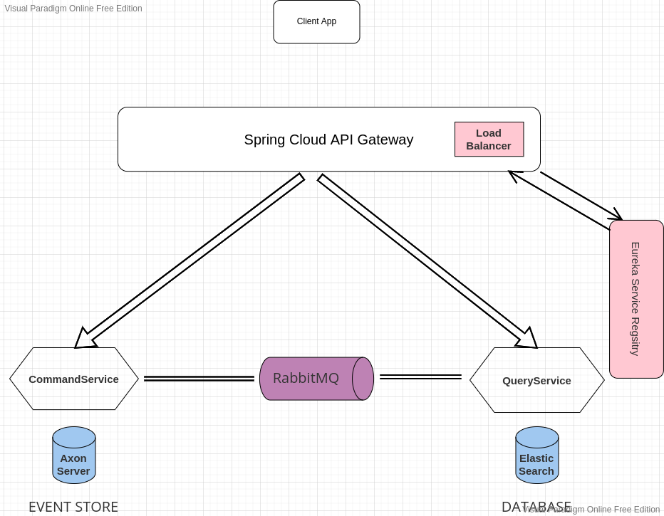

# Overall Architecture



# Requierments

The ProductsCommandService microservice uses axon server as an event store:

## Axon Server

It is an easy-to-use, easy-to-manage platform to handle all events, commands and queries as an event store.

### download link :

https://download.axoniq.io/axonserver/AxonServer.zip

extract the file and run

```bash
cd AxonServer
java -jar axonserver.jar
```

---

RabbitMQ message broker is used to assure an asynchronous communication between the Command microservice and the Query microservice

## RabbitMQ

Run using ready-to-use docker image:

```bash
docker run --rm -it -p 15672:15672 -p 5672:5672 rabbitmq:3-management
```