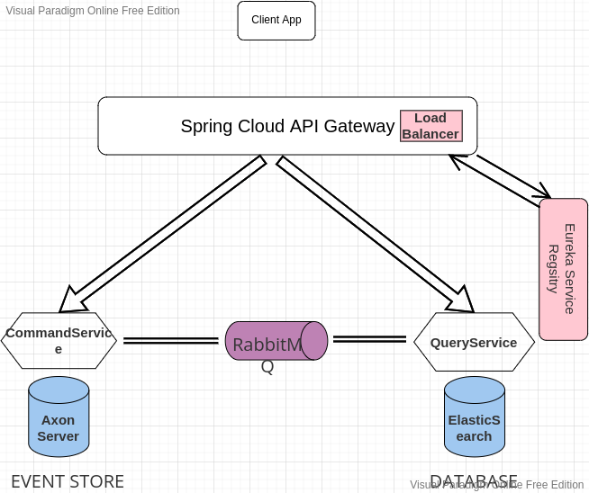

for more details about the project, please check the attached pdf document "Walkthrough_SpringBoot_Microservices_Project"

# To Run the project :

download axon server :
https://download.axoniq.io/axonserver/AxonServer.zip
then run it and run rabbitmq via docker:

```bash
cd AxonServer
java -jar axonserver.jar
docker run --rm -it -p 15672:15672 -p 5672:5672 rabbitmq:3-management
```

then run each microservice independently(Command microservice, Query microservice, Discovery Server and APIGateway).

then run elasticsearch with docker

```bash
sudo docker run -p 9200:9200-e "discovery.type=single-node" docker.elastic.co/elasticsearch/elasticsearch:7.10.0
```

# To test the app

send post request:
with the following body

```
http://localhost:8087/product
{
    "title":"souris",
    "price":1000,
    "quantity":2
}
```

get data via this api

```
http://localhost:8082/products-query-service/products
```

# Overall Architecture



# Requierments

The ProductsCommandService microservice uses axon server as an event store:

## Axon Server

It is an easy-to-use, easy-to-manage platform to handle all events, commands and queries as an event store.

### download link :

https://download.axoniq.io/axonserver/AxonServer.zip

extract the file and run

```bash
cd AxonServer
java -jar axonserver.jar
```

---

RabbitMQ message broker is used to assure an asynchronous communication between the Command microservice and the Query microservice

## RabbitMQ

Run using ready-to-use docker image:

```bash
docker run --rm -it -p 15672:15672 -p 5672:5672 rabbitmq:3-management
```

## ElasticSearch

Run using ready-to-use docker image:

```bash
sudo docker run -p 9200:9200-e "discovery.type=single-node" docker.elastic.co/elasticsearch/elasticsearch:7.10.0
```
